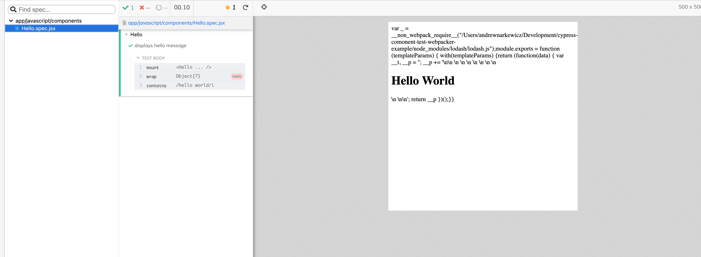

# README
This repo is to demonstrate a strange output when using cypress component tests in a Rails project that uses @rails/webpacker.

This is a default setup for a rails/webpacker project with a very simple react component and component test added.

# Running Instructions
- `yarn install`
- `yarn cypress open-ct`
- Select Hello.spec.jsx
- View extra string content in preview window 
